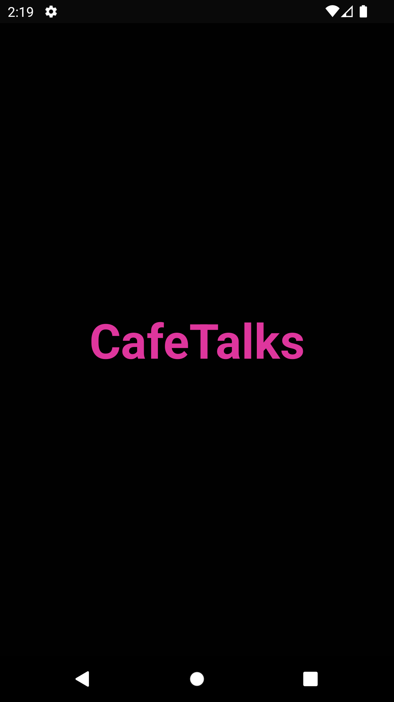
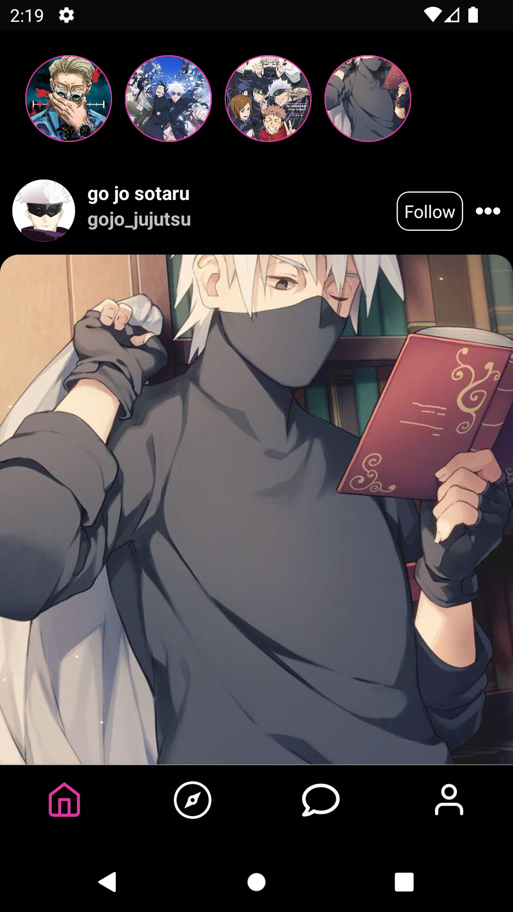

# CafeTalks

a community driven social platform


## Features

- Light/dark mode toggle
- Live previews
- Cross platform
- infinite scroll


## Installation

https://reactnative.dev/docs/environment-setup

use
- yarn in project
- for android yarn android
- for ios yarn ios
    
## Screenshots

 <table>
        <tr>
            <td></td>
            <td></td>
            <td></td>
            <td></td>
            <td></td>
        </tr>
    </table>


## Running Tests

To run tests, run the following command

```bash
  yarn test
```


## Tech Stack

**Client:** React Native, Typescript , Jest + RTL

**Server:** Aws amplify 

